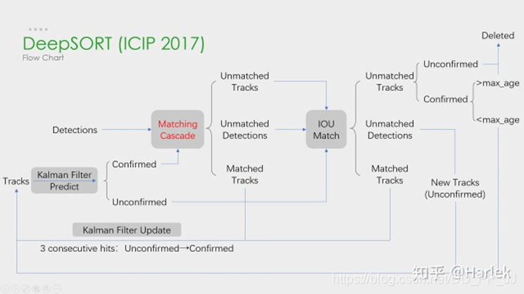

# deepsort+Yolov5实现多目标追踪
本项目基于deepsort和Yolov5实现了一个简单的船舶追踪算法，deepsort是一个基于检测的目标追踪算法，可以方便的替换检测算法。Yolov5是船舶检测模型，
使用onnx模型进行推理，也可以替换为自己的检测模型。项目中追踪和检测分模块进行实现，方便替换自己的的检测算法模型。

有关项目代码讲解参考博客：https://blog.csdn.net/qq_40980981/article/details/139123269?spm=1001.2014.3001.5501

## 环境安装
pip install -r requirement.txt

## deepsort目标追踪
DeepSORT（Deep Simple Online Realtime Tracking）是一种在线的多目标跟踪算法，它能够实现连续帧中对同一个目标的关联，并对目标进行ID分配，以便在整个视频序列中对目标进行跟踪。

项目中追踪算法的实现在deep_sort模块，通过DeepSort类实现追踪功能，DeepSort类中update方法是执行轨迹更新操作，返回当前帧追踪目标信息

## Yolov5目标检测
Yolov5是一种基于anchor的单阶段目标检测算法，通过卷积神经网络对图片进行特征提取，然后对图片进行密集预测，输出目标的类别和位置信息，从而将目标检测任务变成分类和回归任务。

项目中使用yolov5 onnx模型进行推理，模型是作者自己训练的船舶检测模型，也可以修改为自己的检测模型。

## 追踪示例
main.py读取了一个船舶过境视频，然后对该船舶进行追踪。直接运行脚本，即可可视化船舶追踪过程

[output.mp4](doc/output.mp4)

## 修改自己的检测模型
可以将自己的检测模型在detector中进行实现。只需要确保，在调用updata方法时检测框的数据格式符合要求就可以。

        outputs = deepsort.update(xywhs, confss, frame)